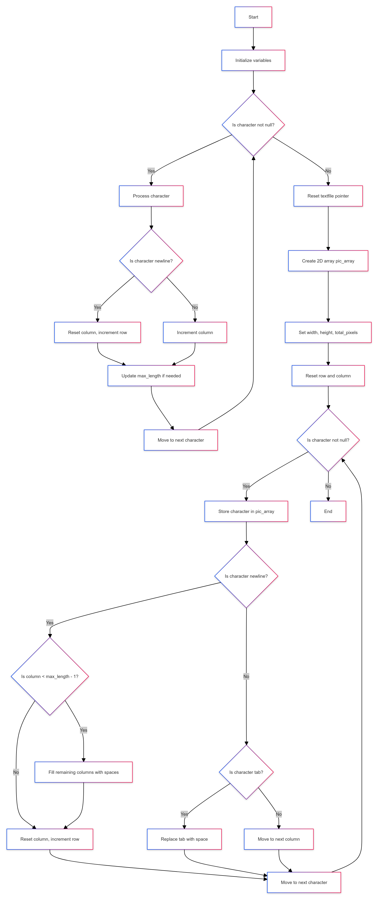

# shuffle Termux / aarch64 version
Shuffle command prints out an ASCII art picture with a cool shuffle effect.

## Version 1.1.0: Now you can shuffle every textfile !

Usage:

shuffle -s speed -c color SOURCE ( In Termux the options must be first and the argument SOURCE last !)

-s  speed: 1 is fast and >500 very slow, -1 = immediately.

-s  color: Must be in format: "r;g;b" or one of the standard colors:
           red, green, yellow, blue, magenta, cyan, orange, white, black, grey or just random.

-h  show this help.

-v  show version

Example: shuffle -s 10 -c "50;255;50" file.ascii :prints file.ascii in bright green.
         shuffle -s 50 -c orange file.ascii :prints it with standard color (orange).


## Build:

```bash
make
```

## Install:

Copy the compiled binary 'shuffle' to your PATH. (or use the binary from releas)

(/data/data/com.termux/files/usr/bin)

## For Archlinux users: It is in the AUR now 'shuffle-ascii'.

</img>
</img>
</img>
