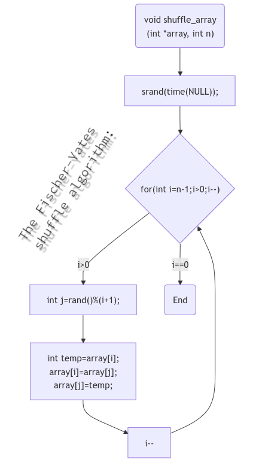

# shuffle
Shuffle command prints out an ASCII art picture with a cool shuffle effect.

You can also shuffle all text files, even with Unicode characters.

Usage:

shuffle SOURCE -s speed -c color

-s  speed: 1 is fast and >500 very slow, -1 = immediately.

-c  color: Must be in format: "r;g;b" or one of the standard colors:
           red, green, yellow, blue, magenta, cyan, orange, white, black, grey or just random.

-h  show this help.

-v  show version

Example: shuffle file.ascii -s 10 -c "50;255;50"  prints file.ascii in bright green.
         shuffle file.ascii -s 50 -c orange  prints it with standard color (orange).


## Build with meson or make:

meson:

```bash
mkdir builddir && meson setup builddir --buildtype=release --prefix=/usr/bin && meson compile -C builddir
```

make:

```bash
make
```

## Install with meson or make:

meson:

```bash
sudo meson install -C builddir
```

make:

```bash
sudo make install
```

## For Archlinux users: It is in the AUR now 'shuffle-ascii'.

</img>
</img>
</img>
